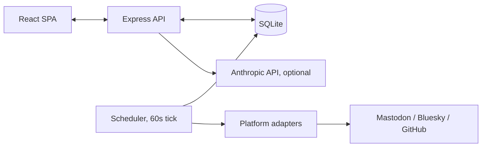

# Personal Content Automation

A personal content operating system — capture ideas, draft, review, approve,
schedule, and publish across platforms, with real automation only where a
free, individual-friendly API genuinely allows it, and an honest
manual-assist fallback everywhere else.

```
IDEA → DRAFT → REVIEW → APPROVED → SCHEDULED → PUBLISHED → ANALYZED
```

## Why I built this

I wanted to demonstrate automation-engineering skills to future clients
without just describing them. So instead of a demo project, I built the
system I actually use for my own content: capture an idea, let AI help
draft it if I want, review it myself, approve it, schedule it, and — for
the platforms that actually have a free API an individual can use — publish
it automatically and pull back real analytics.

Building it for myself first meant I found the bugs (a timestamp-comparison
bug that silently broke the whole scheduler — see `docs/learning-notes.md`)
before a client would have. Everything in this repo is real: no platform
integration here fakes success, no analytics number is invented, and the
system is explicit about which automations are real and which are
honest manual-assist.

## Features

- **Content lifecycle**: idea → draft → review → approved → scheduled →
  published → analyzed, with every transition logged
- **Fast idea capture**, a searchable/filterable content library, and a full
  editor with tags, pillars, and platform-specific variants
- **Calendar** (month + list views) for everything scheduled
- **Real automation** for GitHub (release → idea), Mastodon, and Bluesky
  (real publish + real analytics) — see [What's real vs. manual-assist](#whats-real-automation-vs-manual-assist)
- **A small WHEN/THEN automation rule engine**, a filterable event log, and
  atomic/idempotent job scheduling with retry+backoff
- **Optional AI assistance** (draft generation, rewrite, repurpose, quality
  check) — strictly an assistant, never auto-publishes anything
- **Analytics dashboard** using only real collected metrics, with an honest
  "not available" instead of invented numbers
- **Content intelligence**: pattern insights across pillars/content types,
  refusing to guess below a real sample-size floor
- **Experiment Lab**: every automation documented as trigger → input →
  processing → output → what was actually learned

## Architecture



One Node process (API + in-process scheduler), one SQLite file, a React SPA.
No queue, no microservices — see [`docs/architecture.md`](docs/architecture.md)
for the full breakdown, including the event system, error handling, and why
`node:sqlite` instead of `better-sqlite3`.

## Automation flow

```
Idea
 ↓
Draft (optionally AI-assisted)
 ↓
Human review
 ↓
Approval
 ↓
Scheduler (dry-run by default)
 ↓
Platform adapter
 ↓
Publishing
 ↓
Analytics (real platforms only)
 ↓
Content intelligence
```

Every automation in this system, documented individually with its real
trigger/condition/action/result, is in
[`docs/automation.md`](docs/automation.md) and in the app's own Experiment
Lab page.

## What's real automation vs. manual-assist

| Platform | Publishing | Analytics | Why |
|---|---|---|---|
| GitHub | — (trigger source) | — | Public API, no auth needed, powers the release→idea automation |
| Mastodon | ✅ Real | ✅ Real | Fully open, per-instance OAuth, no gatekeeping |
| Bluesky | ✅ Real | ✅ Real | Fully open AT Protocol, app-password auth |
| Threads | Registered, adapter not built | — | Needs a Meta Developer app even for self-use; scoped out of this build |
| LinkedIn | Manual-assist (copy-ready) | — | Standard apps get no refresh token — 60-day manual reauth, no analytics access ever |
| Instagram | Manual-assist (copy-ready) | — | Requires Business account conversion; not worth the setup for this build's scope |
| X / Twitter | Not integrated | — | Free tier eliminated Feb 2026 — pay-per-post now |

Full reasoning, including what was researched and rejected, in
[`docs/api-research.md`](docs/api-research.md).

## Tech stack

- **Frontend**: React + Vite, plain JS/JSX, Tailwind CSS with a CSS-variable
  token system
- **Backend**: Node.js + Express
- **Database**: SQLite via Node's built-in `node:sqlite` — no native
  compile step, nothing to break on a fresh clone
- **Scheduler**: a single `setInterval` tick, no cron/queue dependency
- **AI**: Anthropic Claude API (optional, `fetch`-based, no SDK dependency)

## Screenshots

Not included in this repo — run it locally (`npm run dev:client` +
`npm run dev:server`, demo mode is on by default) to see it live in under a
minute. Every page works against seeded `[DEMO]`-labeled data with zero
account setup.

## Demo

The app ships in demo mode by default (`DEMO_MODE=true` in
`.env.example`), seeded with clearly `[DEMO]`-labeled sample content, so you
can explore every screen — including a real, live GitHub release-detection
automation if you set `GITHUB_USERNAME` — without connecting any real
accounts.

## Installation

```bash
npm install
cp .env.example .env
npm run db:migrate --workspace server   # creates data/content.db
node server/src/db/seedDemo.js          # seeds demo content + experiments
npm run dev:server                      # http://localhost:4000
npm run dev:client                      # http://localhost:5173
```

Requires Node.js ≥ 22.5 (for built-in `node:sqlite`).

## Environment variables

See [`.env.example`](.env.example) for the full, commented list. Nothing is
required to run the app in demo/dry-run mode — every variable below is
optional and only unlocks its specific feature:

| Variable | Unlocks |
|---|---|
| `GITHUB_USERNAME` / `GITHUB_TOKEN` | Real GitHub release → idea automation |
| `MASTODON_INSTANCE_URL` / `MASTODON_ACCESS_TOKEN` | Real Mastodon publish + analytics |
| `BLUESKY_IDENTIFIER` / `BLUESKY_APP_PASSWORD` | Real Bluesky publish + analytics |
| `ANTHROPIC_API_KEY` | AI draft/rewrite/repurpose/quality-check |
| `DRY_RUN` | Set to `false` to allow real publishing (still per-job overridable) |
| `DEMO_MODE` | Toggles the seeded demo dataset |

## API integrations

Internal REST API documented in [`docs/api.md`](docs/api.md). External API
research and reasoning in [`docs/api-research.md`](docs/api-research.md).

## Security

- No secrets in this repository — `.env` is gitignored, `.env.example`
  holds placeholders only
- Platform credentials live only in `.env` and are read server-side; they
  are never written to the SQLite database or sent to the client
- `data/`, `logs/`, `uploads/` are gitignored
- Dry-run is the default — nothing publishes externally unless you
  explicitly disable it

## Privacy

- Local-first: your content lives in a local SQLite file, not a hosted
  service
- The only third-party API calls this system makes are the ones you
  configure credentials for — nothing is sent anywhere by default
- Using AI assistance sends the relevant content (title/hook/body/notes) to
  Anthropic's API — only when you click an AI action, never automatically
- No analytics/telemetry about your usage of this app itself is collected
  or sent anywhere

## Testing

No automated test suite yet — every phase in this build was instead
verified live against the running app (real HTTP requests, real browser
interaction, and for GitHub specifically, a real external account) rather
than mocked. See `docs/learning-notes.md` and the Experiment Lab for what
each verification actually covered. Adding a real test suite is on the
roadmap below.

## Automation experiments

Nine documented experiments — five working (with real learnings from
testing them live), four honestly marked `planned`. See
[`docs/automation.md`](docs/automation.md) or the Experiment Lab page in
the running app.

## Lessons learned

The full list is in [`docs/learning-notes.md`](docs/learning-notes.md).
The short version: idempotency and atomic job-claiming aren't abstract
concepts once you're the one debugging a duplicate publish, and the
LinkedIn/X research changed real architecture decisions (manual-assist,
no integration at all) rather than just informing a paragraph in a doc.

## Future roadmap

- URL → content draft (Open Graph metadata capture)
- Content pillar → weekly content plan suggestion
- RSS/feed → idea inbox
- Daily summary notification
- Threads adapter (needs a Meta Developer app)
- A real automated test suite

## License

MIT — see [LICENSE](LICENSE).
