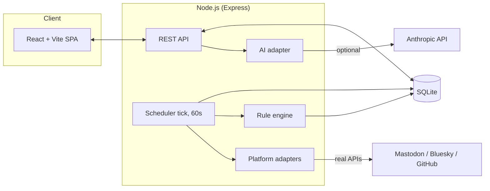
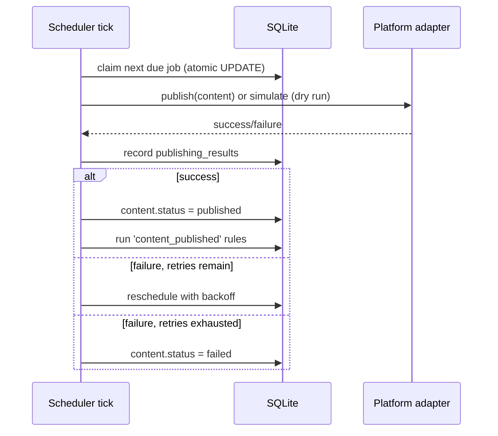

# Architecture

## Overview

A single Node.js process (Express API + in-process scheduler) backed by one
SQLite file, serving a React SPA. No queue, no microservices, no container
orchestration — a personal publishing cadence doesn't need them, and adding
them would be resume-padding, not engineering.



## Frontend

React + Vite, plain JS/JSX (no TypeScript, by preference — see
`docs/design-decisions.md`). Tailwind CSS with a CSS-variable token layer
(`client/src/index.css`) so the dark theme is the only theme and every color
traces back to one of nine tokens. React Router for client-side routing; no
state management library — each page owns its own `useState`/`useEffect`
data fetching via a thin `lib/api.js` wrapper. No premature abstraction: the
same fetch-on-mount pattern repeats across ~10 pages rather than being
generalized into a data-fetching framework, because ten call sites doesn't
justify one.

## Backend

Express, organized by domain rather than by HTTP verb:

```
server/src/
  app.js              # wires all routers
  index.js            # entrypoint: starts server + scheduler + seeds
  db/                 # schema, bootstrap, demo/experiment seeding
  routes/              # one file per resource area
  jobs/                # scheduler, rules, publish, analytics sync, github poll
  adapters/            # one file per external platform/service
```

## Database

SQLite via Node's built-in `node:sqlite` (`DatabaseSync`) — not
`better-sqlite3`. That's a deliberate choice made in Phase 1: `better-sqlite3`
needs a native compile step (Visual Studio Build Tools on Windows), which is
exactly the kind of thing that breaks a fresh `git clone` + `npm install` on
someone else's machine. `node:sqlite` ships with Node 22.5+, needs nothing
extra, and has enough of the same `.prepare().run()/.get()/.all()` shape that
switching was a drop-in change.

Schema lives in one file (`server/src/db/schema.sql`), documented inline —
see the file itself for the full entity list and relationships. The two
tables worth calling out specifically:

- **`processed_external_events`** — the idempotency ledger for anything
  triggered by polling an external source (currently: GitHub releases).
  `(source, external_id)` is the primary key, so the same release can never
  create two ideas, even across restarts.
- **`publishing_results`** — `job_id` is `UNIQUE`, so a duplicate write for
  one job fails loudly instead of silently double-recording a publish.

## Scheduler & Automation Engine

One `setInterval` tick every 60 seconds (`jobs/scheduler.js`) does four
things, in order:

1. **Claim and process due jobs** — `UPDATE scheduled_jobs SET status =
   'publishing' WHERE id = ? AND status = 'pending'` is the atomic
   compare-and-swap that lets two overlapping ticks coexist safely; only one
   can ever win the claim.
2. **Evaluate pollable automation rules** — currently just `stale_in_review`
   (content sitting in review too long), deduped to one reminder per item
   per day.
3. **Poll GitHub for new releases** — throttled to once per 5 minutes,
   independent of the rules table's `enabled` flag which still gates it.
4. **Sync analytics** — pulls real metrics for successfully-published,
   non-dry-run posts on platforms that support it, throttled to once per
   hour per (content, platform) pair.



Automation **rules** (`automation_rules` table) are WHEN/THEN pairs —
`trigger_type` + `action_type` — evaluated either on the poll loop or fired
directly from code right after their triggering event (e.g.
`content_published` fires from the scheduler the moment a publish succeeds).
This is intentionally a small, fixed set of trigger/action types, not a
general workflow engine.

## Platform Adapters

Each adapter (`server/src/adapters/*.js`) exposes whatever subset of
`{testConnection, publish, getAnalytics}` that platform actually supports.
The `platforms` table's capability flags (`supports_publishing`,
`supports_analytics`, ...) are the single source of truth the UI reads to
decide what to show — "real automation" vs "manual-assist" is a data fact,
not a UI label chosen independently. See `docs/api-research.md` for why each
platform landed where it did.

## AI Layer

Optional, gated entirely on `ANTHROPIC_API_KEY` being present
(`server/src/adapters/anthropic.js`, plain `fetch`, no SDK dependency). Every
AI function returns text; nothing it produces is written to the database
without a human clicking an explicit "use this" / "save" action in the UI.
`content.ai_generated` marks anything that passed through AI assistance, so
it stays visibly labeled even after being edited and saved.

## Error Handling

- Every scheduled job gets a bounded number of retries (`max_retries`,
  default 3) with increasing backoff (2 / 10 / 30 minutes), then the job and
  its content both flip to `failed` with the error recorded.
- A job stuck in `publishing` from a previous crash is requeued to `pending`
  on server start (`startScheduler`'s first action).
- Adapter failures never silently succeed — `attemptPublish` catches and
  returns `{success: false, error}`, which the scheduler turns into a
  `PUBLISH_FAILED` event with the real error message attached.

## Event System

`automation_events` is an append-only log every automated action writes to
— content changes, publish attempts, rule firings, AI calls, connection
tests. It's the audit trail (Module 17 in the original brief) and it's also
just useful: the Command Center's "Recent Activity" and the Automation
page's Event Log both read straight from it.
